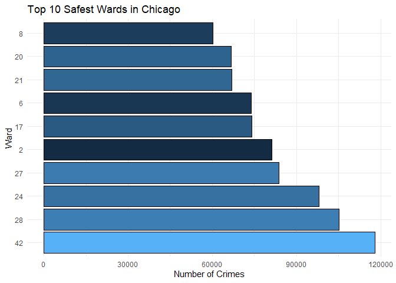

Untitled
================

## Connect SQL and R

we select crime data frame from ChicagoCrime.

``` r
library(dplyr)
library(DBI)
library(dbplyr)
library(odbc)

# odbcListDrivers()

con <- DBI::dbConnect(odbc(),
                      Driver = "SQL Server",
                      Server = "mcobsql.business.nd.edu",
                      UID = "MSBAstudent",
                      PWD = "SQL%database!Mendoza",
                      Port = 3306, 
                      Database = "ChicagoCrime")

# dbListFields(con, "crimes")

# select_q <- dbSendQuery(
#   conn = con, 
#   statement = "SELECT * from crimes"
# )
# 
# select_res <- dbFetch(select_q)
# 
# dbClearResult(select_q)

selected <- dbSendQuery(
  conn = con, 
  statement = "SELECT * from crimes"
)

crime <- dbFetch(selected)
```

## Question 1

We all know Chicago is a dangerous city, depends on that, we can to
discover which ward Chicago will have lowest crime happen. So that
people can choose these ward for visit or travel.

<!-- -->
